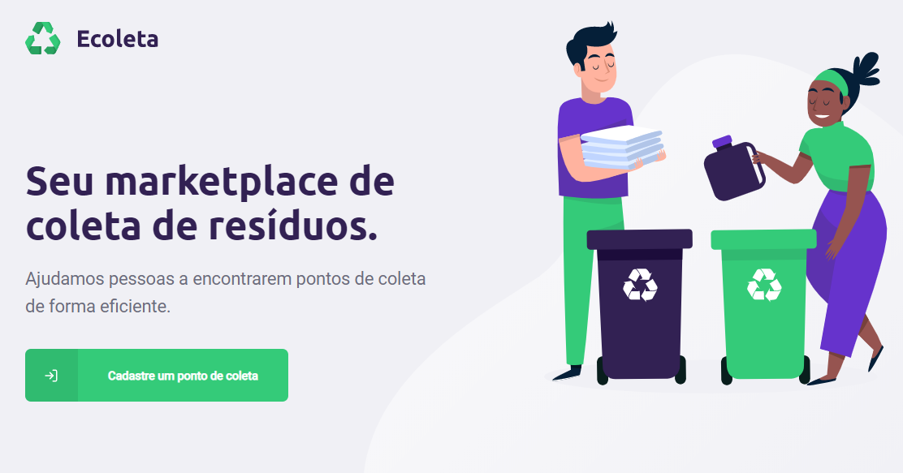

# Projeto Ecoleta
### Projeto desenvolvido durante a semana que rolou a _next level week_, um evento feito pela rocketseat

#### Oque aprendi de novo com o projeto?
* upload de imagens tanto, no front-end e no back-end
* ultilização do expo, para desenvolver com react-native
* validação de dados recebidos em requisições a api 
* conceitos de desenvolvimento mobile
* consumir api's externas no front-end (nesse caso a api do IBGE que retorna cidades e estados)

#### Tecnologias ultilizadas no projeto

* Node.js = back-end da aplicação 
            > conexão com banco de dados 
            > validação de dados 
            > fornecer arquivos estaticos para as aplicações como imagens do projeto
  
* React.js = Parte front-end da aplicação 
            > Responsavel por toda a parte interativa com o usuários 
            > Receber valores que o usuário inseriu em inouts 
            > O modelo SPA além de tirar a responsabilidade do servidor de retornar HTML, torna o uso ao usuário final mais fluido
  
* React-native = Parte mobile da aplicação 
            > O react-native foi ultilixado juntamente da ferramenta expo o que facilita muito o desenvolvimento 
            > Aproveita muitos com conceitos já ultilizados na web para o desenvolvimento mobile 
            > Experiencia de desenvolviemnto aprimorada
            
 ##### Agradecimentos a equipe da _Rocketseat_, pelo conteudo entregue a comunidade 
